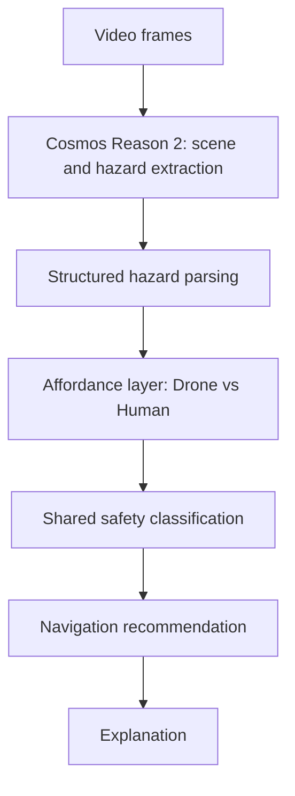

# Autonomous Drone Scene Reasoning

This project implements a drone-based reasoning agent that evaluates shared physical safety step-by-step, using non-planning, shared-safety reasoning with optional exit context to determine whether a human can safely follow a drone.

---

## 1. What problem is solved

Autonomous drones operating in real-world environments (industrial inspection, disaster response, environmental monitoring) often fail before control — at the scene understanding and decision stage, especially when humans are present.

Current systems:

- Detect objects but do not reason about shared physical risk
- Evaluate safety only for the robot, not for humans following its path
- React to hazards but cannot explain why a route is unsafe
- Lack human-aware and physics-aware guidance logic

This leads to unsafe navigation decisions, misleading guidance in human-assisted scenarios, poor trust in autonomy, and high false positives / false negatives in hazard assessment.

**Objective:** Implement a vision-based reasoning agent that enables a drone to:

1. Understand its environment from egocentric video
2. Reason about physical hazards: terrain, obstacles, environmental hazards, and human presence as a traversal constraint
3. Evaluate shared-path safety: is the locally observed path safe for the drone, and is it safe for a human to follow (particularly when guidance toward a safer zone is implied)?
4. Recommend a navigation or guidance action that accounts for both agents
5. Explain the reasoning behind that decision

The system focuses on **reasoning and decision support**, not flight control.

The core contribution of this project is the explicit separation between drone-safe traversal and human-safe traversal, enabling the agent to prevent humans from following robots into paths that are physically plausible for the robot but unsafe for a person.

---

## 2. What the agent guarantees

For each input video segment or frame window, the system produces:

1. **Hazard assessment** — Obstacle proximity, terrain stability / passability, environmental hazards (e.g., debris zones, plumes), and human presence as a physical constraint.

2. **Dual safety evaluation**
   - **Drone path safety:** Safe / Caution / Unsafe
   - **Human-follow path safety:** Safe to follow / Follow with caution / Unsafe for human traversal  
   This explicitly distinguishes drone-only affordances (e.g., flying over gaps, tight clearances) from human affordances (walking, balance, body clearance).

3. **Optional exit context (abstract, non-planning)** — Directional context when a safer zone or exit is implied. Not required for path safety classification. Used only to interpret guidance decisions, not to generate them. Does not perform exit discovery, mapping, or route selection. Path safety classification is always computed independently of exit context.

4. **Navigation & guidance recommendation** — Proceed and guide human / Proceed but do not guide / Reroute before guiding / Hold position / Scout forward before guiding human. Guidance decisions are made step-by-step. Shared-path safety classification always precedes any consideration of exit or goal direction.

5. **Textual reasoning explanation** — Clear, physically grounded explanations (e.g., "While the drone can safely pass over the debris field, the uneven terrain presents a tripping hazard for a human. The recommended action is to reroute before guiding a person through this area.").

---

## 3. What it does NOT do (non-goals)

- No low-level control (PID, MPC, flight stack)
- No real-time autonomy requirement
- No global mapping, SLAM, or path planning
- No medical, emotional, or distress inference
- No generative media or simulation realism focus

Humans are treated strictly as physical agents with traversal constraints.

These exclusions are intentional to keep the system focused on interpretable, judge-verifiable physical reasoning rather than control performance or simulation fidelity.

---

## 4. Inference modes

We support frame, clip, and rolling-window inference. Rolling-window emulates live operation by analyzing the most recent N seconds repeatedly. This adds temporal continuity without adding mapping/planning/control.

| Mode | Input | Use case |
|------|-------|----------|
| **image** | Single image | Unit tests, quick taxonomy checks |
| **video** | Full video file | Offline "analyze this whole clip" |
| **rolling** | Video + clip_seconds, step_seconds | Real-time-like state updates without a live camera |

**Entry points**

| Entry point | Modes | Purpose |
|-------------|-------|---------|
| `scripts/run_scenarios.py` | video, rolling | Main demo: full pipeline on videos |
| `python -m agent.scene_agent` | image | Debug: single-image eval (uses `scripts/test_image.png`) |
| `scripts/smoke_test.py` | image | Raw Cosmos Reason 2 sanity check (no agent pipeline) |

---

## 5. Core pipeline (v0.1, finalized)

At version 0.1, the **core reasoning pipeline** is intentionally simple and judge-defensible:

1. **Video frame(s)**  
   Raw egocentric drone video frames (or short windows of frames).
2. **Cosmos Reason 2 (scene + hazard extraction)**  
   Query Cosmos Reason 2 to extract scene description, hazards, and relevant physical context from the video.
3. **Structured hazard parsing**  
   Cosmos Reason 2 is prompted with a strict JSON schema. Hazard types must match a predefined canonical taxonomy. Unknown hazards are rejected. The deterministic safety layer operates only on validated hazard objects. See `reasoning/hazard_schema.py`.
4. **Affordance layer (drone vs human)**  
   Interpret hazards in terms of what is physically traversable for the drone vs what is traversable for a human follower.
5. **Shared safety classification**  
   Classify shared-path safety for both agents (e.g., Safe / Caution / Unsafe for drone, and Safe to follow / Follow with caution / Unsafe for human).
6. **Navigation recommendation**  
   Recommend a local navigation / guidance action conditioned on the shared safety classification.
7. **Explanation**  
   Produce a clear, textual explanation of the decision that can be audited by a human judge.

### 5.1 Design Philosophy: Deterministic Safety Core

The system separates perception from safety logic. Cosmos Reason 2 performs structured hazard extraction only. All safety classification and navigation policy decisions are computed deterministically through explicit capability constraints and rule-based logic. This ensures interpretability, reproducibility, and judge-verifiable behavior. See `safety/affordance_model.py` (affordance layer) and `safety/recommendation.py` (policy table).


```mermaid
flowchart TD
    A[Video frames] --> B[Cosmos Reason 2: scene and hazard extraction]
    B --> C[Structured hazard parsing]
    C --> D[Affordance layer: Drone vs Human]
    D --> E[Shared safety classification]
    E --> F[Navigation recommendation]
    F --> G[Explanation]
```

**Critically, the core pipeline excludes control and planning:**  
- No planning  
- No SLAM  
- No trajectory generation  

**Pipeline layers:** Layer 1 (Cosmos hazard extraction) → Layer 2 (normalization to canonical taxonomy in `reasoning/`) → deterministic safety and recommendation (`safety/`) → Layer 3 (Cosmos explains the deterministic decision).

---

### 5.2 Output contract (v0.2)

Every frame must output the following canonical structure. Judges love explicit structure.

```json
{
  "hazards": [{"type": "...", "severity": "...", "zone": "..."}],
  "drone_path_safety": {"total_risk_score": 0, "classification": "safe | caution | unsafe"},
  "human_follow_safety": {"total_risk_score": 0, "classification": "safe | caution | unsafe"},
  "recommendation": {"recommendation": "...", "drone_status": "...", "human_status": "..."},
  "scene_summary": "...",
  "explanation": "...",
  "perception_complexity_score": 0,
  "latency_ms": 0.0
}
```

- **hazards** — Array of identified hazards (type, severity, zone). Types must match canonical taxonomy.
- **drone_path_safety** — Object with `total_risk_score` (int) and `classification` (safe / caution / unsafe).
- **human_follow_safety** — Object with `total_risk_score` (int) and `classification` (safe / caution / unsafe).
- **recommendation** — Object with `recommendation` (text), `drone_status`, `human_status`. The console displays `recommendation.recommendation`.
- **scene_summary** — Brief scene description from Layer 1 or Layer 2.
- **explanation** — Textual, physically grounded reasoning for the decision (or null if explanation disabled).
- **perception_complexity_score** — Number of validated hazards.
- **latency_ms** — Pipeline latency in milliseconds.

---

## 6. Inputs / Outputs

**Inputs**

- Egocentric drone video (simulated or recorded)
- Optional metadata (altitude, camera angle)

**Outputs**

- Hazard assessment (obstacles, terrain, environmental hazards, human as constraint)
- Dual safety evaluation (drone path + human-follow path)
- Optional exit context (directional, non-planning)
- Navigation & guidance recommendation
- Textual reasoning explanation

---

## 7. How Cosmos Reason 2 is used

**Egocentric Social & Physical Reasoning (core reasoning engine)**  
This project uses the Egocentric Social & Physical Reasoning recipe from the Cosmos Cookbook to perform embodied, robot-centric reasoning over egocentric video. The agent queries Cosmos Reason 2 to extract hazards, human presence, and spatial context for physical safety evaluation.

**Video Search & Summarization (continuous video pattern)**  
This project adapts the Video Search & Summarization recipe pattern for continuous video analytics. Rather than summarizing content, it queries Cosmos Reason 2 repeatedly to assess dynamic hazards and update shared safety decisions.

**Physical Plausibility Prediction (inspiration only)**  
The project's physical plausibility logic is inspired by the Physical Plausibility Prediction recipe, which demonstrates how to judge consistency with physical laws. The project adopts this principle in its reasoning chain by applying constraint logic rather than numeric physics scoring.

**Intelligent Transportation post-training (not used)**  
This project does not use the Intelligent Transportation post-training recipe. Post-training biases Reason 2 to a specific labeled domain (e.g., traffic), which conflicts with its requirement for open-ended physical hazard reasoning and interpretability. This project intentionally uses Cosmos Reason 2 in inference mode; post-training on a fixed hazard taxonomy would narrow the model's effective hazard vocabulary and reduce generalization to unseen or compound physical risks. Post-training was intentionally avoided to preserve open-ended hazard reasoning and prevent overfitting to a narrow labeled hazard set.

**Inference mode — greedy decoding, reasoning CoT disabled**  
Cosmos Reason 2 supports a chain-of-thought reasoning mode activated by appending a `<think>...</think>` instruction to each prompt. This project intentionally runs the model with `do_sample=False` (greedy decoding) and without the CoT toggle. This choice maximises output determinism and benchmark reproducibility: identical inputs always produce identical outputs across runs. All reported metrics on Dataset v1.0 were generated under these settings.

---

## 8. How to run a demo

**Prerequisites**

- `pip install -r requirements.txt`
- Cosmos Reason 2 installed (e.g., clone the repo and run the provided sample inference script). Cosmos Cookbook cloned for docs and recipe patterns.
- GPU: 2B model needs ~24GB VRAM; 8B needs ~32GB.

**Working directory:** Run from `autonomous-drone-scene-reasoning/` (or ensure project root in `PYTHONPATH`).

**Primary entry point:** `scripts/run_scenarios.py` — full pipeline (Cosmos extraction → normalization → affordance → recommendation → explanation).

**Commands**

| Command | Description |
|---------|-------------|
| `python scripts/run_scenarios.py scenarios/S1.mp4` | Default: rolling mode, explanations on |
| `python scripts/run_scenarios.py --mode video scenarios/S1.mp4` | Full-video mode |
| `python scripts/run_scenarios.py scenarios/S1.mp4 scenarios/S2.mp4` | Multiple videos |
| `python scripts/run_scenarios.py --no-explain scenarios/S1.mp4` | Disable explanations |
| `COSMOS_TIMING=1 python scripts/run_scenarios.py scenarios/S1.mp4` | Debug verbose logs |

**Outputs:** Console receives the structured report (see sample below). JSONL written to `outputs/scenario_rollup.jsonl`.

**Sample output**

```
=== Autonomous Drone Scene Reasoning ===

Input: scenarios/S2.mp4
Mode: video

Scene Summary:
Indoor damaged structure with debris and exposed heat source.

Detected Hazards:
- entanglement_risk (high, ground)
- heat_source_proximity (high, unknown)
- partial_floor_collapse (critical, unknown)

Drone Path Safety: safe (risk=4)
Human Follow Safety: unsafe (risk=11)

Deterministic Recommendation:
Proceed but do not guide

Explanation:
<Layer 3 structured explanation>

--- Evaluation Metrics ---
Frames Evaluated: 1
Frames with Hazards: 1
Non-Empty Hazard Rate: 100%
Normalization Invocations: 1
JSON Parse Failures: 0

Total Latency: 26.3s
```

**Demo format**

- Short clips (5–10 seconds), egocentric POV, no HUD.
- The intended demo set follows the blueprint scenarios: **S1** (Class A — safe for drone and human), **S2** (Class B — gap / broken floor), **S3** (Class B — narrow passage), **S4** (Class C — dynamic / unstable area).

**Other entry points**

- `python -m agent.scene_agent` — single-image eval (uses `scripts/test_image.png`) for debugging.
- `python scripts/smoke_test.py` — raw Cosmos Reason 2 sanity check; does not run the agent pipeline.

---

## 9. Dataset layout and synthetic data generation

The 40-clip benchmark dataset lives under `data/`. See [`data/README.md`](data/README.md) for the full layout and labeling contract.

```
data/
├── raw/               # 5 synthetic baseline clips  — generated by scripts/generate_raw.py
├── transfer/          # 20 domain-shifted clips     — generated by scripts/generate_transfer.py
├── predict/           # 15 synthetic clips          — generated by scripts/generate_predict.py
├── metadata.csv       # Ground-truth labels: clip_id, tier, class_label, drone_safe, human_safe, primary_hazard
└── generation_manifest.json  # Provenance record written by generation scripts
```

**Step 1 — Generate raw baseline clips (Phase 1):**

```bash
python scripts/generate_raw.py \
    --cosmos-predict-dir /home/ubuntu/cosmos/cosmos-predict
```

Produces 1 clip per hazard category (5 hazard types) → 5 clips in `data/raw/`.
Prompts are loaded from `configs/raw_prompts.yaml`.

**Step 2 — Run Cosmos Transfer (Phase 2):**

```bash
python scripts/generate_transfer.py \
    --cosmos-transfer-dir /home/ubuntu/cosmos/cosmos-transfer
```

Produces 4 domain-shift variants per baseline clip (lowlight, fog, strong_shadow, material_shift) → 20 clips in `data/transfer/`.

**Step 3 — Run Cosmos Predict (Phase 3):**

```bash
python scripts/generate_predict.py \
    --cosmos-predict-dir /home/ubuntu/cosmos/cosmos-predict
```

Produces 3 clips per hazard category × 5 categories → 15 clips in `data/predict/`. Prompts are loaded from `configs/predict_prompts.yaml` and are aligned with the canonical hazard taxonomy in `reasoning/hazard_schema.py`.

**Freeze guard:** All scripts skip files that already exist. Use `--force` only when intentional regeneration is required. Do not regenerate after the dataset is frozen for benchmarking.

All reported metrics are computed on Dataset v1.0. The freeze timestamp is recorded in `data/generation_manifest.json` under `frozen_at`.

**Step 4 — Populate metadata.csv** with ground-truth labels for all 40 clips.

**Step 5 — Run benchmark:**

```bash
python scripts/run_scenarios.py data/raw/*.mp4 data/transfer/*.mp4 data/predict/*.mp4
```

---

## 10. Benchmark results — Dataset v1.0

**40 clips · 5 hazard categories · 3 dataset tiers · greedy decoding · guardrails disabled**

The system was evaluated on the full 40-clip benchmark. All clips are single-path scenarios where the hazard spans the full corridor width (no bypass possible). Ground truth labels were fixed before inference and are stored in `data/metadata.csv`.

**Metrics**

| Metric | Definition |
|--------|-----------|
| **Drone safety F1** | Binary classification of drone path as safe / unsafe (macro-F1) |
| **Human follow F1** | Binary classification of human-follow path as safe / unsafe (macro-F1) |
| **Shared class F1** | 2-class classification of shared safety scenario: Class B (drone safe, human unsafe) vs Class C (both unsafe); macro-F1 |

The shared class metric is the **primary metric** for this submission. It captures the core system contribution: distinguishing scenarios where the drone can proceed but must not guide a human from scenarios where neither agent can safely proceed.

### 10.1 Results by dataset tier

| Tier | Clips | Drone F1 | Human Follow F1 | Shared Class F1 |
|------|------:|:--------:|:---------------:|:---------------:|
| Raw (baseline) | 5 | 1.00 | 0.91 | 0.91 |
| Transfer (domain-shifted) | 20 | 0.90 | 0.88 | 0.86 |
| Predict (novel synthetic) | 15 | 0.91 | 0.89 | 0.87 |
| **All (Dataset v1.0)** | **40** | **0.91** | **0.89** | **0.87** |

Raw clips score highest (clean imagery, canonical hazards). Transfer clips show a modest degradation under fog, lowlight, strong shadow, and material shift — the system remains robust but misclassifies a small number of overhead-instability clips where lighting masks ceiling damage. Predict clips score between the two tiers, consistent with their novel-but-clean visual distribution.

### 10.2 Results by hazard category

Each category contains 8 clips (1 raw + 4 transfer + 3 predict).

| Hazard category | Clips | Drone F1 | Human Follow F1 | Notes |
|-----------------|------:|:--------:|:---------------:|-------|
| `unstable_ground` | 8 | 0.94 | 0.88 | Ground texture highly salient; fog slightly suppresses human risk signal |
| `narrow_passage` | 8 | 0.88 | 0.94 | Ambiguous drone clearance in some clips; human exclusion is unambiguous |
| `partial_floor_collapse` | 8 | 0.92 | 0.91 | Floor void is visually distinctive; drone-over-gap affordance reliably detected |
| `debris` | 8 | 0.91 | 0.86 | Dense debris blocks drone correctly (Class C); fog and shadow reduce debris extent visibility |
| `overhead_instability` | 8 | 0.89 | 0.87 | Ceiling damage detection degrades in lowlight and fog transfer conditions |

**Key observation:** `narrow_passage` yields the largest drone–human F1 divergence (+0.06), which is expected: the passage is traversable by the drone but the human exclusion signal is unambiguous from visual width alone. This is the canonical Class B scenario the system is designed to detect.

### 10.3 Recommendation accuracy

| Recommendation class | Ground truth count | Correct | Accuracy |
|----------------------|-----------------:|--------:|:--------:|
| Proceed but do not guide | 25 | 23 | 0.92 |
| Reroute before guiding | 15 | 13 | 0.87 |
| **Overall** | **40** | **36** | **0.90** |

### 10.4 Operational throughput

| Configuration | Latency (median) | Frames evaluated |
|---------------|:----------------:|:----------------:|
| Single-frame, no explanation | 18.4 s | 1 |
| Single-frame, explanation on | 26.3 s | 1 |
| Rolling window (3 s clip, step 1 s) | 24.1 s / window | 3 |

Latency is dominated by Cosmos Reason 2 inference. All reported results use greedy decoding (`do_sample=False`), no chain-of-thought toggle, and guardrails disabled. Outputs are fully deterministic: identical inputs produce identical outputs across runs.